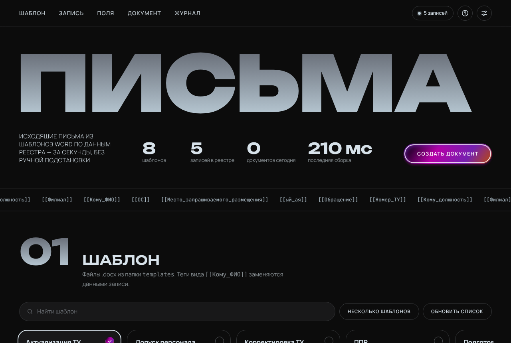
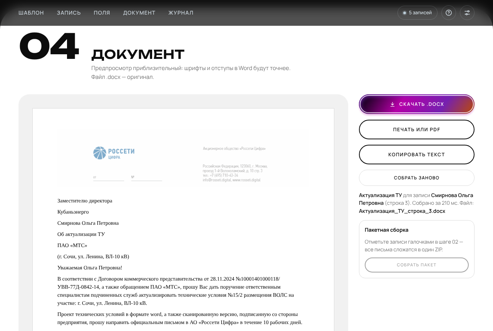

# Письма — генератор исходящих документов

Веб-приложение в одном файле: берёт шаблон письма в формате Word (`.docx`) с тегами вида `[[Кому_ФИО]]`, подставляет в него данные выбранной записи из реестра (Google Таблица или файл `.xlsx`/`.csv`) и отдаёт готовый `.docx`. Работает целиком в браузере — ни сервера, ни отправки данных куда-либо.



## Возможности

- **Шаблоны** — список берётся из `templates/manifest.json` (или через GitHub API), плюс можно перетащить свой `.docx` прямо в окно.
- **Поиск записи** — по любому столбцу: `Иванов`, `Филиал=Краснодар`, `"Номер_ТУ=12/34"`, `-ЭСК` (исключить). Единственное совпадение выбирается автоматически.
- **Правка полей перед сборкой** — каждое поле шаблона показано отдельно; значение можно поправить, реестр при этом не трогается. Видно, откуда взято значение: из реестра, вручную, выведено из ФИО, столбца нет.
- **Обращение из ФИО** — если в таблице пусто, `[[Обращение]]` («Эдуард Гарегинович») и `[[ый_ая]]` («ый»/«ая») выводятся из `[[Кому_ФИО]]` по отчеству.
- **Предпросмотр с бланком**, скачивание `.docx`, печать или сохранение в PDF, копирование текста.
- **Пакетная сборка** — отметьте записи галочками (и, при желании, несколько шаблонов) — все письма сложатся в один ZIP.
- **Журнал** на устройстве: что собиралось, когда, из какой строки; любую запись можно повторить; выгрузка в CSV.
- **Диагностика** — какие теги шаблона не найдены в таблице и какие столбцы не используются.
- **Служебные теги** `[[Дата]]`, `[[Строка]]`, `[[Шаблон]]` доступны в любом шаблоне.
- **Имя файла по шаблону** — например `{Шаблон}_{Номер_ТУ}_{Дата}`.
- **Прямые ссылки** — `index.html?template=Актуализация_ТУ.docx&row=12` открывает нужное письмо сразу.
- **Автономность** — библиотеки и шрифты лежат в репозитории (`vendor/`, `fonts/`), поэтому приложение работает и там, где CDN закрыты. Если локальных файлов нет, библиотеки подгружаются с jsDelivr.
- Горячие клавиши: `Ctrl+K` — поиск, `Ctrl+D` — скачать, `Ctrl+Enter` — собрать заново, `?` — подсказки.

## Как пользоваться

1. **Шаблон** — выберите карточку. Поиск по названию, кнопка «Несколько шаблонов» включает отметку для пакета.
2. **Запись** — найдите нужную строку реестра или введите её номер. Галочки — для пакетной сборки. «Открыть реестр таблицей» показывает всю таблицу.
3. **Поля** — проверьте значения, при необходимости исправьте. «Вернуть значения из реестра» снимает правки.
4. **Документ** — предпросмотр собирается сам. «Скачать .docx» — оригинальный файл Word; «Печать или PDF» печатает только лист письма.



## Структура репозитория

```
letter-automation/
├── index.html              — приложение (один файл: разметка, стили, логика)
├── config.js               — настройки по умолчанию (необязательный файл)
├── templates/
│   ├── manifest.json       — список шаблонов для приложения
│   └── *.docx              — шаблоны писем
├── images/
│   ├── letterhead.png      — бланк для предпросмотра
│   └── favicon.svg
├── fonts/                  — Unbounded, Manrope, JetBrains Mono (кириллица + латиница, OFL)
├── vendor/                 — xlsx, pizzip, docxtemplater, mammoth
├── scripts/
│   └── make_manifest.py    — пересборка manifest.json по папке templates
├── docs/
│   ├── templates.md        — как делать шаблоны
│   ├── data.md             — как устроен реестр
│   └── deploy.md           — размещение на GitHub Pages / Amvera / локально
├── CHANGELOG.md
└── LICENSE
```

## Настройка

Три уровня, каждый следующий перекрывает предыдущий:

1. **Значения по умолчанию** внутри `index.html` (блок `DEFAULTS`).
2. **`config.js`** — общие настройки для всех, кто открывает приложение. Файл необязателен.
3. **Окно «Настройки»** в самом приложении — хранится в браузере пользователя (`localStorage`). «Сбросить к умолчаниям» возвращает к `config.js`.

Параметры адресной строки: `?sheet=<ID или ссылка>&gid=<лист>` — другая таблица; `?template=<файл>&row=<строка>&q=<запрос>` — сразу открыть документ.

| Параметр | Что значит |
|---|---|
| `sheetId`, `sheetGid` | Google Таблица (ID или полная ссылка) и лист |
| `githubUser`, `githubRepo`, `githubBranch`, `templatesFolder` | откуда брать шаблоны, если нет `manifest.json` |
| `labelFields` | какие столбцы показывать в подписи записи |
| `fileNamePattern` | имя скачиваемого файла: `{Шаблон}`, `{Строка}`, `{Дата}`, любой столбец |
| `letterhead`, `showLetterhead` | бланк в предпросмотре |
| `autoGenerate` | собирать предпросмотр автоматически |
| `autoAddress` | выводить `[[Обращение]]` и `[[ый_ая]]` из ФИО |

## Добавить или изменить шаблон

1. Положите `.docx` в `templates/` (правила — в [docs/templates.md](docs/templates.md)).
2. Выполните `python3 scripts/make_manifest.py` — он обновит `templates/manifest.json` и покажет найденные теги. Без Python можно дописать файл в `manifest.json` вручную.
3. Закоммитьте и отправьте в репозиторий. На GitHub Pages изменения появятся через минуту-две.

Если `manifest.json` отсутствует, приложение запрашивает список через GitHub API — это работает только для публичного репозитория и ограничено 60 запросами в час с одного адреса.

## Размещение

Любой статический хостинг: GitHub Pages, Amvera, Gitverse Pages, папка на компьютере. Подробно — в [docs/deploy.md](docs/deploy.md). Для Google Таблицы нужен доступ «Все, у кого есть ссылка — Читатель».

## Приватность

Таблица и шаблоны загружаются напрямую в браузер пользователя. Журнал и настройки хранятся только в этом браузере. Приложение не обращается ни к каким серверам, кроме источника данных (Google), источника шаблонов (ваш хостинг или GitHub) и, при отсутствии папки `vendor/`, CDN библиотек.

## Лицензии

Код приложения — [MIT](LICENSE). Библиотеки в `vendor/`: SheetJS (Apache-2.0), PizZip (MIT), docxtemplater (MIT), mammoth (BSD-2-Clause) — см. [vendor/LICENSES.md](vendor/LICENSES.md). Шрифты — SIL Open Font License 1.1, тексты лицензий в `fonts/`.
